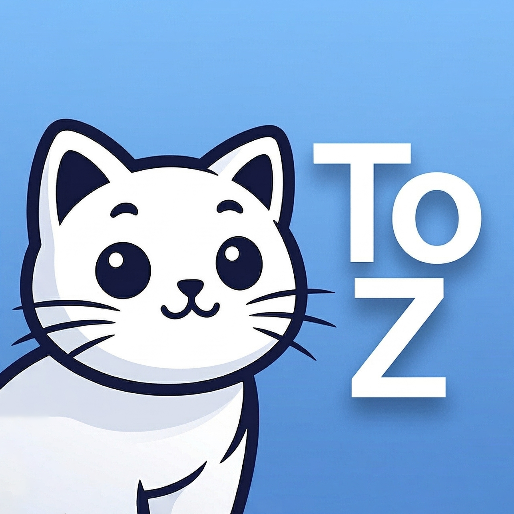

<h1>ZoT</h1>

<b>「ZoT Cracked Pro.」</b>

用于改善部分场景下的使用体验

  <b>支持框架</b>：
  <b><a href="https://github.com/LSPosed/LSPosed">LSPosed 101+</a></b>

---

## 项目简介

- 对于部分APP的解锁会员/VIP功能
- 增强软件能力，优化用户体验
---

## 使用说明

1. 安装 **LSPosed**，并确保框架可用
2. 在 LSPosed 中为 **ZoT** 勾选需要生效的目标应用（作用域）
3. 保存后按提示 **强制停止并重新打开** 目标应用

> 如未生效，请尝试登录账号  
> 如果还是未生效，可能是不适配您的版本  
> 以上或其他问题，请前往[交流群组](https://t.me/ZoTChat)进行反馈

---

## 框架说明

### LSPosed (101+)

- 在作用域中勾选目标应用即可

### 其他 / LSPatch

- 未针对 **LSPatch** 等场景做专门验证；能否使用取决于框架对 libxposed 模块的兼容程度
- 若在无 root 封装环境中无法加载，属预期外场景，需自行排查

---

## 免责声明

- 应用内所有功能仅供学习交流使用，请勿用于商业或违法用途
- 本模块完全免费使用，不存在收费盈利
- 如果你是付费购买的，请联系售卖者退款
- 禁止售卖、倒卖或二次打包分发本模块
- 因使用本模块产生的任何后果，由使用者自行承担
- 如有侵权问题，请联系邮箱: skycoreyun@gmail.com
